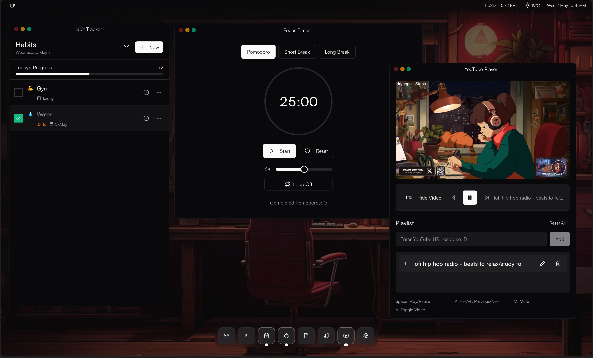

# Focus Brew

<div align="center">
  
</div>

## 🧠 About

Focus Brew is a comprehensive productivity suite designed to help you stay focused, organized, and efficient. It combines multiple productivity tools in one elegant interface.

> **Note:** This project was 100% built using vibe coding with [Cursor](https://www.cursor.com/), [v0.dev](https://v0.dev/), and [21st.dev](https://21st.dev/).

**Official site:** [https://focusbrew.vercel.app/](https://focusbrew.vercel.app/)

## ✨ Features

- **Pomodoro Timer**: Boost your productivity with customizable work/break intervals
- **Ambient Sounds**: Enhance focus with a variety of ambient sounds from nature, urban environments, and more
- **Todo App**: Keep track of your tasks in a simple, intuitive interface
- **Habit Tracker**: Build and maintain positive habits with visual tracking
- **Notepad**: Jot down quick notes and thoughts
- **Kanban Board**: Organize your workflow visually
- **YouTube Player**: Watch educational content without distractions
- **Weather Forecast**: Check current weather conditions and forecasts
- **Currency Exchange**: Convert between different currencies with up-to-date exchange rates

## 🚀 Technologies

This project was developed using the following technologies:

- [Next.js](https://nextjs.org/)
- [React](https://reactjs.org/)
- [TypeScript](https://www.typescriptlang.org/)
- [Tailwind CSS](https://tailwindcss.com/)
- [shadcn/ui](https://ui.shadcn.com/)
- [Framer Motion](https://www.framer.com/motion/)
- [Lucide React](https://lucide.dev/)

## 🔧 Getting Started

### Prerequisites

- Node.js (version 18 or higher)
- pnpm
- OpenWeather API key (for weather functionality)

### Environment Variables

Create a `.env` file in the root directory with the following:

```
NEXT_PUBLIC_OPENWEATHER_API_KEY=your_openweather_api_key
```

You can get an API key by registering at [OpenWeather](https://openweathermap.org/api).

### Installation

1. Clone this repository

```bash
git clone https://github.com/your-username/focus-brew.git
```

2. Navigate to the project directory

```bash
cd focus-brew
```

3. Install dependencies

```bash
pnpm install
```

4. Start the development server

```bash
pnpm dev
```

5. Open [http://localhost:3000](http://localhost:3000) with your browser to see the result.

## 🌟 Usage

Focus Brew is designed to be intuitive and easy to use:

1. **Start a Pomodoro Session**: Set your timer and get to work
2. **Play Ambient Sounds**: Choose from various categories of sounds to create your perfect focus environment
3. **Manage Tasks**: Add, update, and track your tasks with the Todo App
4. **Take Notes**: Use the Notepad to capture your ideas
5. **Track Habits**: Build consistency with the Habit Tracker
6. **Organize Projects**: Use the Kanban board to visualize your workflow
7. **Watch Educational Content**: Use the distraction-free YouTube player
8. **Check Weather**: View current weather conditions and forecasts
9. **Convert Currencies**: Use the Currency Exchange to convert between different currencies

## 📄 License

MIT License

Copyright (c) 2024 Focus Brew

Permission is hereby granted, free of charge, to any person obtaining a copy
of this software and associated documentation files (the "Software"), to deal
in the Software without restriction, including without limitation the rights
to use, copy, modify, merge, publish, distribute, sublicense, and/or sell
copies of the Software, and to permit persons to whom the Software is
furnished to do so, subject to the following conditions:

The above copyright notice and this permission notice shall be included in all
copies or substantial portions of the Software.

THE SOFTWARE IS PROVIDED "AS IS", WITHOUT WARRANTY OF ANY KIND, EXPRESS OR
IMPLIED, INCLUDING BUT NOT LIMITED TO THE WARRANTIES OF MERCHANTABILITY,
FITNESS FOR A PARTICULAR PURPOSE AND NONINFRINGEMENT. IN NO EVENT SHALL THE
AUTHORS OR COPYRIGHT HOLDERS BE LIABLE FOR ANY CLAIM, DAMAGES OR OTHER
LIABILITY, WHETHER IN AN ACTION OF CONTRACT, TORT OR OTHERWISE, ARISING FROM,
OUT OF OR IN CONNECTION WITH THE SOFTWARE OR THE USE OR OTHER DEALINGS IN THE
SOFTWARE.
